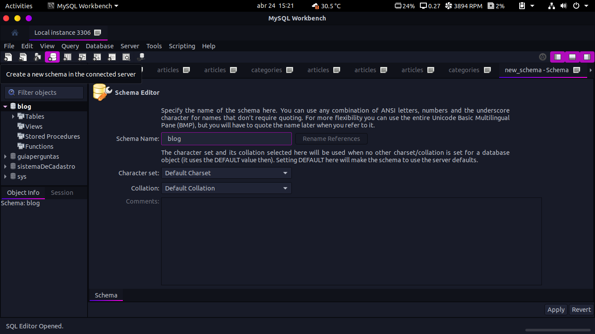
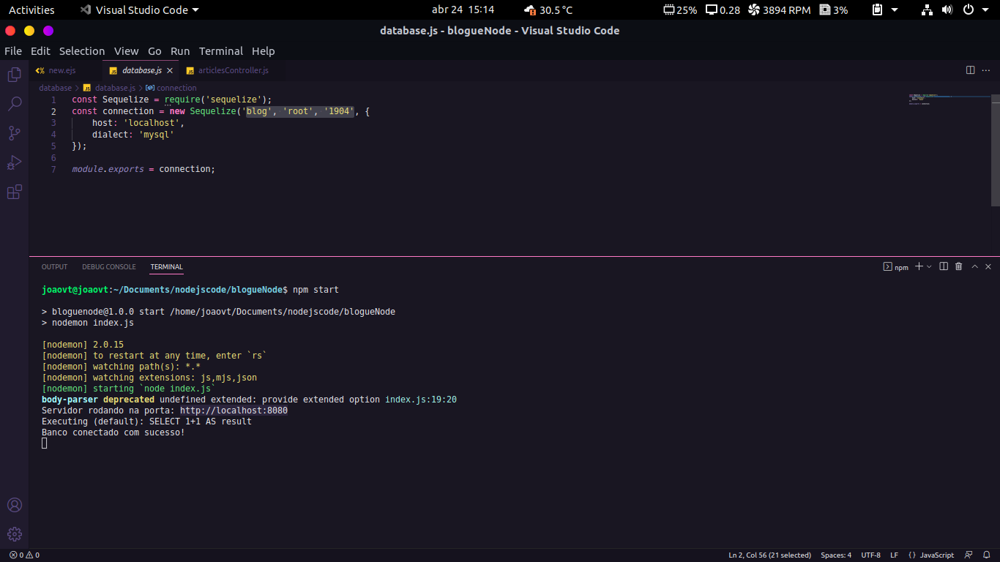
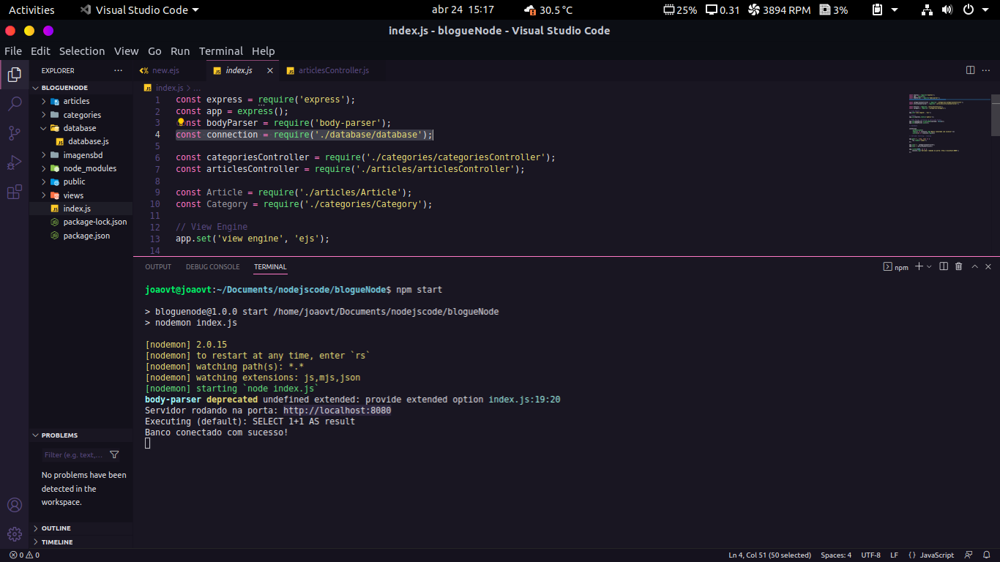
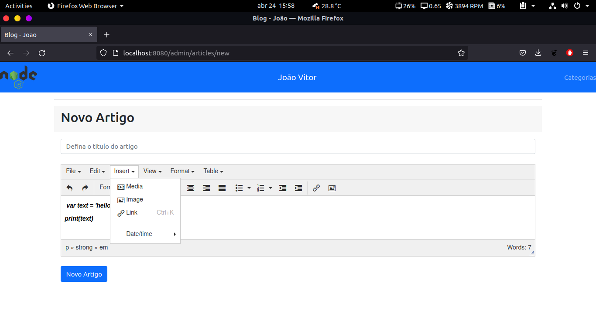

# Blog do João
	

 

- 	Esse Blog foi feito usando as seguintes tecnologias: JavaScript, NodeJS, Express, Sequelize, Banco de dados MySQL, EJS. 

- 	O blog permite você adicionar conteúdos como um titulo e descrição por exemplo, além de adicionar imagem e deletar os mesmo caso você seja o Administrador do Blog. 
	
## Iniciando o Projeto

- 	Para iniciar o projeto rode o seguinte comando:
*		npm i
- 	com isso ele iria adicionar todas dependências necessarias que estão no arquivo package.json
- 	feito isso você também irá precisar configurar o seu banco de dados MySQL.

## Banco de dados MySQL

- 	Para configurar o seu banco de dados MySQL você irá precisar installar o MySQL e o MySQL workbench.
- 	irei te recomendar 2 videos para isso, são eles:
      Windows: <a href="https://www.youtube.com/watch?v=fmerTu7dWk8&t=327s&ab_channel=B%C3%B3sonTreinamentos">Link</a>
      Linux: <a href="https://www.youtube.com/watch?v=CBK7c1xp-zI&list=LL&index=11&ab_channel=B%C3%B3sonTreinamentos">Link</a>
      
## Configurando o Banco MySQL  
  - Para configurar o Banco MySQL com o sequelize iremos abrir o nosso MySQL-Workbench e criar um novo schema. 
   
  
- 	coloque o nome do banco de dados de: * blog * e em seguida vá clicando em apply conforme for pedindo.
- 	após ter definido o nome do banco de dados, na pásta database/database.js nós definimos para o sequilize a origem dele passando o seu nome, usuario e senha. 
   
- 	após ter feito essa configuração, eu exportei o banco e puxei o mesmo na nossa aba principal que roda o servidor "index.js" e rodei dando um npm start.
   
  
## Formatando textos

-	para formartar os textos usamos o <a href="https://www.tiny.cloud/get-tiny/">TinyMCE</a>
- 	O TinyMCE permite que nós façamos todas as edições de textos do blog, exemplo: adicionar imagens, links, tabelas etc.... 
-	Nesse caso você não ira precisar baixar ele pois já está incluso no código. também não ira precisar configurar nada.
	
	 
  
## Rodar o projeto.

  - para rodar o projeto, iremos rodar o seguinte comando: * npm start
  - e acessar no seu navegador o endereço: 
*	 http://localhost:8080

